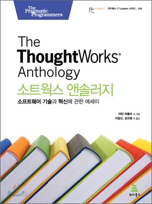

# 객체지향 생활 체조 원칙
### 객체지향 생활 체조 원칙이란?



소트웍스 앤솔러지

객체지향 생활 체조 원칙은 소트웍스 앤솔러지 책에서 다루고 있는 내용으로 객체지향 프로그래밍을 잘 하기 위한 9가지 원칙을 제시하고 있다.

이 책에서 주장하는 9가지 원칙은 다음과 같다. 

### 규칙 1: 한 메서드에 오직 한 단계의 들여쓰기(indent)만 한다.

<details>
<summary>Content</summary>

```java
public class Test {
    
    public void sayHello(String name, String message) {
        if ("진우".equals(name)) {
            if (!message.isEmpty()) {
                System.out.println("Hello, " + name + ", " + message +"!");
            } else {
                System.out.println("Hello, " + name + "!");
            }
        }
    }
    
}
```

<details>
<summary>규칙 1 Refactoring</summary>

```java
public class Test {

    public void newSayHello(String name, String message) {
        if ("진우".equals(name)) {
            printMessage(name, message);
        }
    }

    public void printMessage(String name, String message) {
        if (!message.isEmpty()) {
            System.out.println("Hello, " + name + ", " + message +"!");
        } else {
            System.out.println("Hello, " + name + "!");
        }
    }
    
}
```
</details>
</details>

### 규칙 2: else 예약어를 쓰지 않는다.

<details>
<summary>Content</summary>

```java
public class Test {

    public void sayHello(String name, String message) {
        if (!message.isEmpty()) {
            System.out.println("Hello, " + name + ", " + message + "!");
        } else {
            System.out.println("Hello, " + name + "!");
        }
    }
    
}
```

<details>
<summary>규칙 2 Refactoring</summary>

```java
public class Test {

    public void newSayHello(String name, String message) {
        if (!message.isEmpty()) {
            System.out.println("Hello, " + name + ", " + message + "!");
            return;
        }
        System.out.println("Hello, " + name + "!");
    }

}
```
</details>

</details>

### 규칙 3: 모든 원시값과 문자열을 포장한다.

<details>
<summary>Content</summary>

```java
public class User {
    
    private String name;
    private int age;

    public User(String nameValue, String ageValue) {
        int age = Integer.parseInt(ageValue);
        validateAge(age);
        validateName(nameValue);
        this.name = nameValue;
        this.age = age;
    }

    private void validateName(String name) {
        if (name.length() < 2) {
            throw new RuntimeException("이름은 두 글자 이상이어야 합니다.");
        }
    }

    private void validateAge(int age) {
        if (age < 0) {
            throw new RuntimeException("나이는 0살부터 시작합니다.");
        }
    }
    
}
```

<details>
<summary>규칙 3 Refactoring</summary>

```java
public class User {
    
    private Name name;
    private Age age;

    public User(String name, String age) {
        this.name = new Name(name);
        this.age = new Age(age);
    }
    
}

public class Name {
    
    private String name;

    // User에서 처리하던 validateName을 Name에서 처리한다.
    public Name(String name) {
        if (name.length() < 2) {
            throw new RuntimeException("이름은 두 글자 이상이어야 합니다.");
        }
        this.name = name;
    }
    
}

public class Age() {
    
    private int age;

    // User에서 처리하던 validateAge를 Age에서 처리한다.
    public Age(String input) {
        int age = Integer.parseInt(input);
        if(age < 0) {
            throw new RuntimeException("나이는 0살부터 시작합니다.");
        }
    }
    
}
```
유효성 검증을 비롯한 이름, 나이 값에 대한 상태값을 User에게 넘기지 않고 스스로 관리할 수 있게 되었다.

책임이 명확해졌다.
</details>
</details>

### 규칙 4: 한 줄에 점을 하나만 찍는다.

<details>
<summary>Content</summary>

```java
public class MemberService {
    
    public getFirstOrderProductName(String memberId) {

        Member member = memberRepository.findById(memberId);
        
        String firstOrderProductName = member.getOrderHistory().get(0).getOrder().getProduct().getName();

    }
    
}

public class Member {

    private String id;
    private List<Order> orders;

}

public class Order {
 
    private Product productName;
    
}

public class Product {
    
    private String name;
    
}
```

<details>
<summary>규칙 4 Refactoring</summary>

```java
public class ProductService {
    
    public String getFirstOrderProductName(Long productId) {
        
        Product product = productRepository.findTopById(productId);
        return product.getName();
        
    }

}

public class Member {

    private String id;
    private List<Order> orders;

}

public class Order {

    private Product productName;

}

public class Product {

    private String name;

}
```
점을 하나만 찍으라는 것은 단순히 라인에 존재하는 점의 개수를 헤아려 줄이라는 의미는 아니다.

점을 찍는 행위는 필드나 메소드를 통해 인스턴스에 접근하는 행위를 의미한다.

점의 개수가 많다는 것은 대상 객체의 내부에 깊이 접근하겠다는 의도를 드러내게 되고, 이는 호출자와 피호출자 사이에 강한 결합도가 형성되었다는 것을 의미한다.
</details>
</details>

### 규칙 5: 줄여쓰지 않는다(축약 금지).

<details>
<summary>Content</summary>

```javascript
const btnName = "ABC";
```

<details>
<summary>규칙 5 Refactoring</summary>

```javascript
const buttonName = "ABC";
```
</details>
</details>


### 규칙 6: 모든 엔티티를 작게 유지한다.

<details>
<summary>Content</summary>

이 원칙에서 칭하는 엔티티는 클래스, 패키지를 통틀어 업무적 구분을 갖는 단위를 의미한다.

**작은 엔티티** 라고 판단할 수 있는 대략적인 기준은 다음과 같다.

- 50줄 이하의 클래스

- 10개 이하의 파일을 갖는 패키지

엔티티를 작성할 때 하나의 목적을 염두하고 설계하라는 의미이다. 

SOLID 원칙중 '단일 책임 원칙' 과도 상통한다. 

먼저 클래스의 크기를 줄여 분리하기 시작하면, 작은 역할을 하게 될 것이다. 

이 때 작은 역할을 통해 이루려는 하나의 목적을 도출할 수 있다. 

그 목적을 이루기 위한 클래스들을 모아 패키지로 구성하면 된다.

</details>

### 규칙 7: 3개 이상의 인스턴스 변수를 가진 클래스를 쓰지 않는다.

<details>
<summary>Content</summary>

클래스의 인스턴수 변수를 제한하라는 지침이다. 

여기서의 인스턴수 변수는 원시타입, 또는 컬렉션과 같이 기본 또는 자료구조형의 변수를 의미한다.

클래스의 인스턴수 변수는 클래스가 관리하는 **상태** 를 의미한다. 

클래스의 상태는 클래스의 정체성을 나타내는 요소이다. 

이 상태의 종류가 많다는 것은 클래스가 여러 종류의 정체성을 가지고 설계되었다는 것을 의미한다.

이 지침은 원칙의 세 번째 지침인 **모든 원시값과 문자열을 포장한다** 의 내용과 통한다.
</details>

### 규칙 8: 일급 콜렉션을 쓴다.

<details>
<summary>Content</summary>

콜렉션을 포함한 클래스는 반드시 다른 멤버 변수가 없어야 한다.

각 콜렉션은 그 자체로 포장돼 있으므로 이제 콜렉션과 관련된 동작은 근거지가 마련된셈이다.

필터가 이 새 클래스의 일부가 됨을 알 수 있다.

필터는 또한 스스로 함수 객체가 될 수 있다.

또한 새 클래스는 두 그룹을 같이 묶는다든가 그룹의 각 원소에 규칙을 적용하는 등의 동작을 처리할 수 있다.

이는 인스턴스 변수에 대한 규칙의 확실한 확장이지만 그 자체를 위해서도 중요하다.

콜렉션은 실로 매우 유용한 원시 타입이고 많은 동작이 있지만 후임 프로그래머나 유지보수 담당자에 의미적 의도나 단초는 거의 없다.

```java
public class Member {
    
    private Map<String, Integer> products = new HashMap<>();
    
    public void addProduct(String productName, Integer quantity) {
        products.put(productName, quantity);
    }
    
}
```

<details>
<summary>규칙 8 Refactoring</summary>

```java
public class Member {

    private final Bucket bucket;
    
    public Member(Bucket bucket) {
        this.bucket = bucket;
    }

    public void addProduct(String productName, Integer quantity) {
        bucket.addProduct(productName, quantity);
    }
    
}

public class Bucket {

    private final Map<String, Integer> products;

    public Bucket() {
        products = new HashMap<>();
    }
    
    public Map<String, Integer> getProducts() {
        return Collections.unmodifiableMap(products);
    }
    
    public void addProduct(String productName, Integer quantity) {
        products.put(productName, quantity);
    }
    
}
```
</details>
</details>

### 규칙 9: 게터/세터/프로퍼티를 쓰지 않는다.

<details>
<summary>Content</summary>


</details>

### 왜 객체지향 생활 체조 원칙인가?
객체지향 설계와 구현은 수학 공식을 외워서 문제를 푸는 것과 달리 이론을 안다고 해도 이 이론을 설계와 구현에 녹여내려면 지속적인 수련이 필요한 영역이다.
여기서 수련이라는 의미는 어느 누구나 야구공을 던지는 이론은 다 알고 있지만 이론을 안다고 누구나 다 프로선수 처럼 공을 던질 순 없고 지속적인 훈련(수련)을 통해서만 가능하다.

많은 개발자들이 지속적인 수련이 중요하다는 것은 알기 때문에 객체지향 설계와 구현 연습에 도전한다.
하지만 객체지향 설계를 다루고 있는 대부분의 책이 추상적인 이론을 다루고 있기 때문에 초보 개발자는 몇 번 도전 후에 포기하는 상황이 발생한다.
특히 어려운 점은 소스 코드 중 문제가 있는 부분을 찾는 것이다. 어떻게 리팩토링할 것인지는 그 다음 이슈이다.
개선할 부분을 찾지도 못하는 개발자들에게 아무리 객체지향 설계와 구현과 관련한 이론을 제시해도 무용지물이다.

객체지향 생활 체조 원칙은 추상적인 가이드가 아니라 구체적인 가이드를 제시하고 있다.
따라서 초보 개발자도 코드 중에서 리팩토링할 부분(Bad Smell이 있는 부분)이 있는 코드를 쉽게 찾을 수 있으며, 도전해 볼 수 있다.
예를 들어 "규칙 1: 한 메서드에 오직 한 단계의 들여쓰기(indent)만 한다."는 정말 구체적이다.
코드 중 들여쓰기가 2 이상인 코드가 있다면 그 부분을 어떻게 리팩토링할 것인지 고민하면 된다.

이와 같이 구체적인 가이드를 통해 꾸준히 수련하다보면 어느 순간 객체지향 설계와 관련한 추상적인 이론들이 이해되는 시점이 찾아온다.
